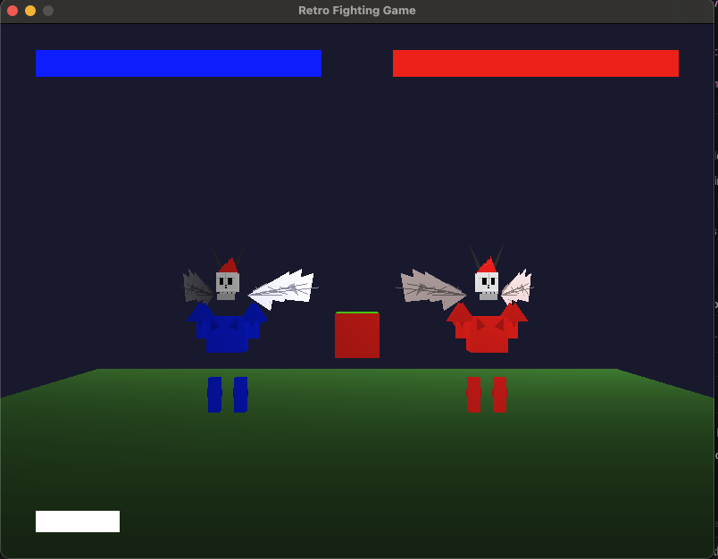

# Retro Fighting Game

```
                                    FIGHT!
    P1                                                  P2
    [■]█                                              █[■]
    /|\                                               /|\
    / \                                               / \
  ══════════════════════════════════════════════════════════
```

A 3D fighting game built with Python, Pygame, and OpenGL featuring dynamic combat mechanics and special abilities.



## Features

- Two-player combat system
- Dynamic physics-based movement
- Multiple combat abilities:
  - Melee attacks (punch/kick)
  - Projectile attacks (missiles)
  - Fire breath attacks
- Advanced movement system:
  - Double jumping
  - Air control
  - Momentum-based combat
- Visual effects:
  - Colored fire breath matching character colors
  - Missile trails
  - Explosion effects
- Health system with visual health bars
- Score tracking

## Controls

### Player 1 (Blue)
- Movement: Arrow Keys (LEFT/RIGHT)
- Jump/Double Jump: UP Arrow
- Punch: M
- Kick: N
- Shoot Missile: B
- Fire Breath: V

### Player 2 (Red)
- Movement: A/D Keys
- Jump/Double Jump: W
- Punch: Q
- Kick: E
- Shoot Missile: R
- Fire Breath: F

## Combat Tips

- Double jump can be used for better positioning
- Fire breath must be aimed in the correct direction to deal damage
- Combine attacks for effective combos
- Use momentum for stronger melee attacks
- Missiles are effective at long range
- Fire breath is powerful at close range

## Installation

Method 1 (Recommended):
1. Clone the repository:
```bash
git clone https://github.com/yourusername/battlers.git
```

2. Run the install script:
```bash
python install.py
```

3. Activate the virtual environment:
   - On Windows: `.venv\Scripts\activate`
   - On Unix/MacOS: `source .venv/bin/activate`

4. Run the game:
```bash
python game.py
```

Method 2 (Manual):
1. Clone the repository:
```bash
git clone https://github.com/yourusername/battlers.git
```

2. Install requirements:
```bash
pip install -r requirements.txt
```

3. Run the game:
```bash
python game.py
```

## Requirements

- Python 3.x
- Pygame
- PyOpenGL
- NumPy

## Game Mechanics

### Movement
- Characters can move left and right
- Double jumping allows for aerial maneuvers
- Momentum affects attack damage

### Combat
- Melee attacks do damage based on momentum
- Fire breath must be aimed correctly
- Missiles leave trailing effects
- Health bars show current character status

### Special Effects
- Character-colored fire breath
- Missile trails
- Explosion particles
- Visual hit feedback

## Contributing

Feel free to submit issues and enhancement requests!

## License

[Your chosen license]
